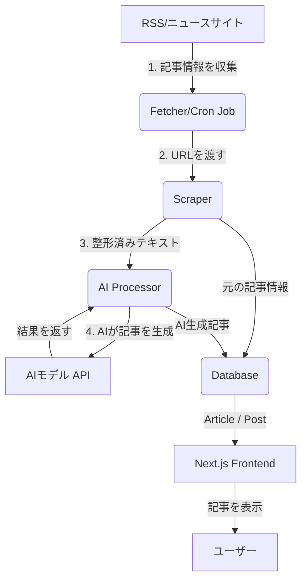
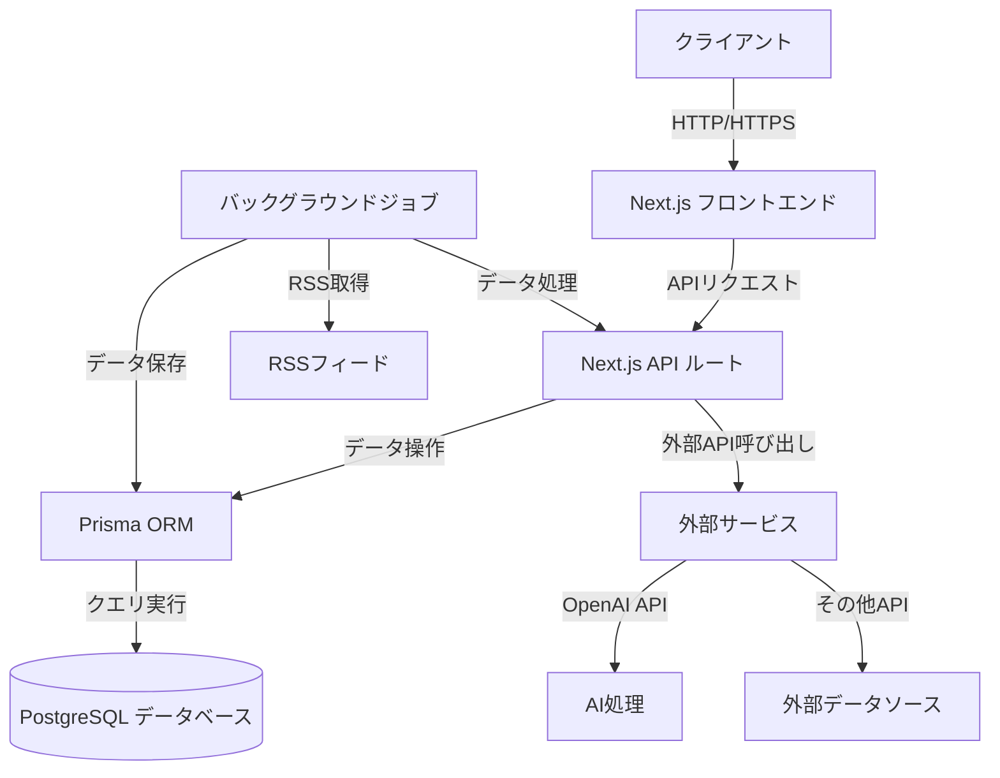

# MatoSokuNews アーキテクチャ

## AIによる記事自動更新システム

このシステムは、外部のニュースソースから記事を自動的に収集し、AIモデルを活用して新しいコンテンツを生成・更新することを目的とします。

### システム構成要素

1.  **情報収集 (Fetcher)**:
    -   指定されたRSSフィードやニュースサイトから、定期的に新しい記事のURLと基本情報を収集します。
    -   この処理は、バックグラウンドで実行されるスケジュールされたジョブ（Cron Job）によって自動的に行われます。

2.  **記事内容の取得と整形 (Scraper)**:
    -   収集したURLから記事の本文を取得し、HTMLタグなどを取り除いてテキストデータに整形します。

3.  **AIによる記事生成 (AI Processor)**:
    -   整形された記事の本文を、指定されたAIモデル（例: GPT-4, Claude 3）に送信します。
    -   AIは、記事の要約、新しいタイトルの生成、カテゴリ分類などを行います。

4.  **データベースへの保存 (DB Store)**:
    -   収集した元の記事情報は`Article`モデルに保存します。
    -   AIが生成した新しい記事は`Post`モデルに保存し、元の`Article`と関連付けます。

5.  **表示 (Frontend)**:
    -   Next.jsアプリケーションが、データベースからAI生成記事を読み込み、ユーザーに表示します。

### データフロー




このドキュメントでは、MatoSokuNewsのシステムアーキテクチャと主要コンポーネントについて説明します。

## システム概要図



## 主要コンポーネント

### 1. フロントエンド (Next.js)

- **ページルーティング**: Next.jsのApp Routerを利用
- **UIコンポーネント**: React + TypeScriptで構築
- **スタイリング**: Tailwind CSS + CSS Modules
- **状態管理**: React Context API + useReducer
- **データフェッチ**: SWR または React Query

### 2. バックエンド (Next.js API Routes)

- **APIエンドポイント**: RESTful API設計
- **認証・認可**: NextAuth.js
- **バリデーション**: Zod
- **エラーハンドリング**: カスタムエラークラス
- **ロギング**: Winston + ログローテーション

### 3. データレイヤー

- **ORM**: Prisma
- **データベース**: PostgreSQL
- **マイグレーション**: Prisma Migrate
- **シードデータ**: 開発環境用初期データ

### 4. バックグラウンド処理

- **RSSフィード取得**: 定期的なクロール
- **コンテンツ処理**: 重複排除、正規化
- **AI処理**: 要約、関連記事のグループ化
- **スケジューリング**: node-cron または Bull

## データフロー

1. **コンテンツ収集フェーズ**
   - RSSフィードから記事を収集
   - ウェブスクレイピング（必要に応じて）
   - 外部APIからのデータ取得

2. **コンテンツ処理フェーズ**
   - 重複チェック
   - コンテンツの正規化
   - 言語処理・形態素解析
   - カテゴリ分類

3. **AI処理フェーズ**
   - 記事の要約生成
   - 関連記事のグループ化
   - 新規コンテンツの生成
   - 感情分析（オプション）

4. **公開フェーズ**
   - コンテンツの品質チェック
   - スケジュールに基づいた公開
   - ソーシャルメディアへの自動投稿

## ディレクトリ構造

```
src/
├── app/                    # Next.js App Router
│   ├── api/                # API ルート
│   ├── (auth)/             # 認証関連ルート
│   ├── (dashboard)/        # ダッシュボード関連ルート
│   └── [...]               # その他のページ
│
├── components/             # 再利用可能なUIコンポーネント
│   ├── ui/                 # 基本的なUIコンポーネント
│   ├── layout/             # レイアウトコンポーネント
│   └── features/           # 機能別コンポーネント
│
├── lib/                    # ユーティリティ関数とヘルパー
│   ├── api/                # APIクライアント
│   ├── utils/              # ユーティリティ関数
│   └── constants/          # 定数定義
│
├── prisma/                 # Prismaスキーマとマイグレーション
│   ├── migrations/         # データベースマイグレーション
│   ├── schema.prisma       # Prismaスキーマ
│   └── seed.ts             # シードデータ
│
├── styles/                 # グローバルスタイル
└── types/                  # グローバル型定義
```

## セキュリティ対策

- **入力検証**: すべての入力に対して適切なバリデーションを実施
- **CORSポリシー**: 厳格なオリジンホワイトリストを設定
- **レートリミット**: APIエンドポイントへの過剰なリクエストを制限
- **セキュアな認証**: JWT + リフレッシュトークン
- **セキュアな設定**: 機密情報は環境変数で管理

## スケーラビリティ

- **水平スケーリング**: ステートレスなアーキテクチャ
- **キャッシュ戦略**: Redisによるキャッシュ
- **非同期処理**: 重い処理はバックグラウンドジョブにオフロード
- **CDN連携**: 静的アセットの配信最適化

## 監視とロギング

- **パフォーマンスモニタリング**: Sentry
- **エラートラッキング**: Sentry
- **アクセスログ**: 構造化ログ（JSON形式）
- **メトリクス収集**: Prometheus + Grafana

## デプロイメント

- **コンテナ化**: Docker + Docker Compose
- **CI/CD**: GitHub Actions
- **インフラストラクチャ**: クラウドプロバイダー（AWS/GCP/Azure）
- **データベース**: マネージドPostgreSQLサービス

## 今後の拡張性

- **マイクロサービスアーキテクチャ**への移行準備
- **イベント駆動アーキテクチャ**の導入
- **機械学習パイプライン**の強化
- **マルチリージョン展開**のサポート
